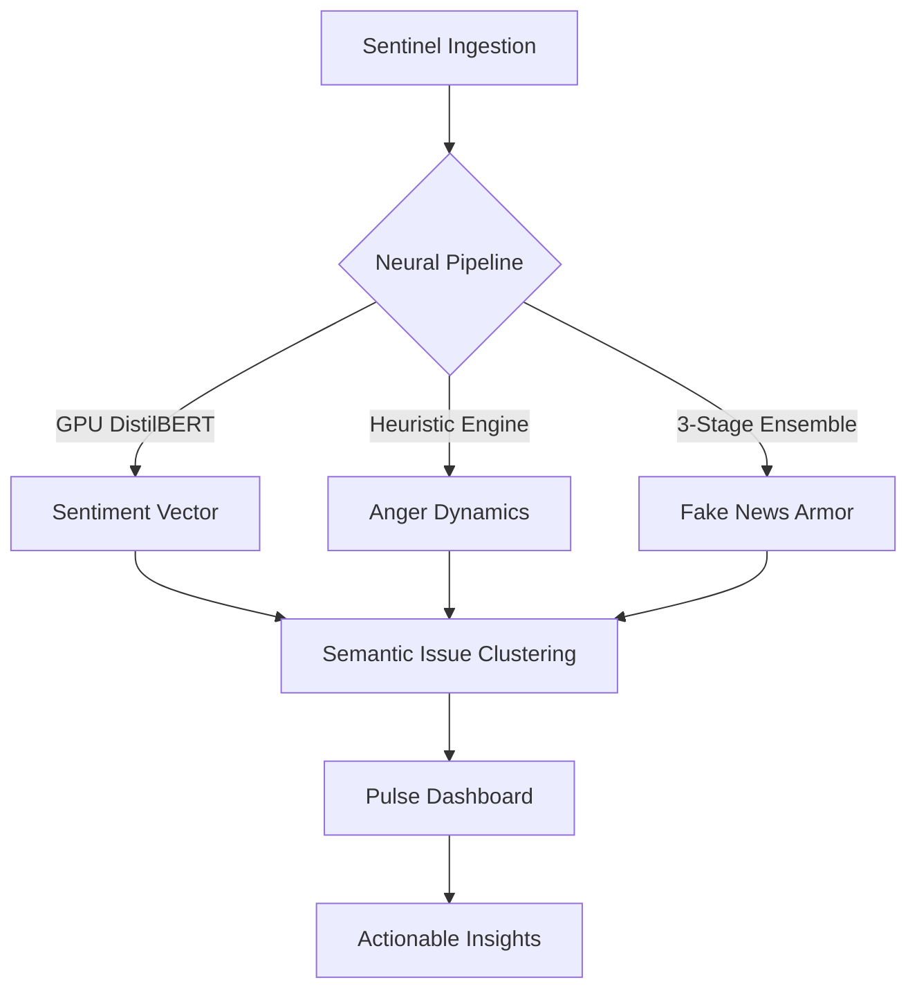

<div align="center">
  <h1>JanNetra</h1>
  <p><b>State-of-the-Art Neural Governance & Intelligence Interface</b></p>

  [](https://fastapi.tiangolo.com/)
  [](https://reactjs.org/)
  [](https://www.mongodb.com/)
  [](https://huggingface.co/transformers/)
</div>

> [!IMPORTANT]
> **JanNetra** is a state-of-the-art **Predictive Governance Intelligence Platform**. It leverages a high-fidelity neural pipeline to transform multi-source noise into actionable governance insights, providing a real-time "Command Surface" for societal stability.

---

## 🏗️ Intelligence Architecture

JanNetra is architected as a decoupled, multi-tier intelligence system.

### 1. **Sentinel Layer (Ingestion Engine)**
The Sentinel layer is responsible for continuous wide-spectrum data harvesting:
- **Global News Aggregation:** Pulls from **NewsAPI** (150+ verified outlets) and the **GDELT Project**, which monitors global events in real-time.
- **Social Pulse Ingestion:** High-speed scrapers for **Reddit** and other social platforms to identify community grievances before they reach official channels.
- **Official Governance Mirror:** Dedicated listeners for **PIB India** and regional press releases to cross-reference community signals with official state data.
- **RSS Mesh:** A curated registry of Tier-1 Indian news outlets (The Hindu, NDTV, India Express) for high-credibility signal verification.

### 2. **Neural Layer (Signal Distillation)**
Raw data is processed through a high-fidelity NLP pipeline:
- **Sentiment Vectorization:** Uses **GPU-accelerated DistilBERT** to map public emotional polarity (-1.0 to +1.0).
- **Anger Dynamics Engine:** Calculates a weighted **Anger Rating (0-10)** based on linguistic intensity and amplification patterns.
- **Entity & Claim Extraction:** Automatically identifies 30+ major Indian cities and 15+ government departments involved in each signal.
- **3-Stage Fake News Guard:** An ensemble model evaluating **Linguistic Manipulation**, **Evidence Grounding**, and **Source Reliability**.

### 3. **Logic Layer (Synthesis & Escalation)**
Where signals become intelligence:
- **Semantic Clustering:** Uses NLP-based similarity scoring (Cosine Similarity > 0.65) to group individual reports into unified **Issue Clusters**.
- **Priority Escalation:** Each cluster is assigned a **Priority Score (0-100)** based on frequency, source visibility, and collective public anger.
- **GRI Scoring:** The **Governance Risk Index** provides a multi-dimensional risk assessment across source credibility, temporal anomalies, and network amplification.

---

## 🚀 Autonomous Detection & Command Dashboard

### **Auto-Problem Detection**
JanNetra eliminates manual monitoring by automating the entire detection lifecycle:
- **The 30-Minute Cycle:** Every 30 minutes, the background scheduler triggers a full "Harvest -> Analyze -> Cluster" run.
- **Proactive Flagging:** Issues with a **Priority Score > 80%** are automatically flagged as **CRITICAL** and pushed to the high-priority queue.
- **Dynamic Deduping:** SHA-256 content hashing ensures that the dashboard remains ghost-free and doesn't re-process duplicate signals.

### **Dashboard Features**
The **Executive Command Surface** provides immediate situational awareness:
- **Executive Suite:** Real-time KPI widget for total issues processed, average AI accuracy, and mean system latency.
- **Risk Heatmap:** A visual breakdown of risks categorized by department (Infrastructure, Police, Health) and geographic severity.
- **Sentiment Pulse:** A historical line-chart illustrating the fluctuation of public mood and anger trends over time.
- **Signal Monitor:** A live-updating feed of active clusters, allowing leaders to drill down into the "raw evidence" behind every AI-detected problem.

---

## 🧠 Technical Deep-Dives: Risk Metrics

JanNetra utilizes an advanced ensemble of models and algorithms to quantify the "unquantifiable."

### 🛡️ **Linguistic Manipulation Index (LMI)**
To combat modern disinformation, JanNetra calculates the **LMI** across six linguistic vectors:
- **Clickbait Score:** Pattern detection for sensationalist headlines.
- **Hedging Ratio:** Frequency of unverified attributions (e.g., "sources say").
- **Emotional Amplification:** Detection of aggressive punctuation and superlative density.
- **Caps Ratio:** Monitoring of manipulation-style capitalization.
- **Source Absence:** Heuristic penalty for lack of named authoritative attribution.
- **Passive Voice Density:** Calculating obfuscation levels in reporting.

### 📊 **Governance Risk Index (GRI)**
The **GRI** is computed across 5 weighted dimensions:
- **Source Credibility (30%):** Weighted historical accuracy and source tiering.
- **Linguistic Manipulation (25%):** The LMI composite score.
- **Cross-Reference Consistency (20%):** Comparing claims against verified knowledge graphs.
- **Temporal Anomaly (15%):** Identifying coordinated burst-posting patterns.
- **Network Amplification (10%):** Viral-style content density assessment.

---

## 🗄️ Core Data Models & Schemas

JanNetra utilizes a robust schema-validated MongoDB backend for signal persistence.

| Entity | Description | Core Attributes |
| :--- | :--- | :--- |
| **SignalProblem** | Aggregated issue cluster | `frequency`, `priority_score`, `locations`, `status` |
| **NewsArticle** | Raw harvested intelligence | `content_hash`, `source_url`, `sentiment_polarity`, `gri_score` |
| **Alert** | Escalated notification | `severity`, `department`, `recommendation`, `is_active` |
| **SystemMetric** | Subsystem health state | `subsystem_name`, `current_value`, `status`, `ai_diagnosis` |
| **User** | Governance stakeholder | `role`, `department`, `firebase_uid`, `auth_provider` |

---

## 🖼️ Full Feature Catalog

### **1. Executive Command Suite**
- **Pulse Dashboard:** The primary high-level awareness interface.
- **Risk Map (GIS):** Geospatial visualization of governance problems with district-level granularity.
- **Analytics Hub:** Deep-dive into historical sentiment and risk heatmaps.

### **2. Signal & Problem Management**
- **Signal Monitor:** Real-time auditing of AI-detected issue clusters.
- **Problem Detail:** AI-generated summaries, evidence summaries, and automated resolution paths.
- **Resolutions Portal:** Tracking and verifying fixed problems with "Proof of Work" audits.

### **3. Monitoring & Security**
- **System Monitoring:** Transparent tracking of the ingestion engine, memory, and model health.
- **Scanner:** Ad-hoc NLP tool for one-time verification of external text or URLs.
- **Smart Chatbot:** AI-driven governance assistant for rule-based query handling.

---

## 🛠️ System Blueprint



---

## 🖥️ Live Pulse Console
*Simulated real-time signal processing logs:*

```console
[SENTINEL] :: INGESTING :: REDDIT/MUMBAI-COMMUNITY -> 15 SIGNALS
[NEURAL]   :: ANALYSIS  :: CLUSTER-8A2F -> { ANGER: 8.4, SENTIMENT: NEGATIVE }
[SYTHESIS] :: PRIORITY  :: ISSUE-44C -> RATING: 92.5 [CRITICAL]
[COMMAND]  :: ALERT     :: INFRASTRUCTURE BREACH DETECTED IN DISTRICT-INDORE
```

---

---

## ⚡ Technical Specification & Security

### **1. Security Architecture**
- **Authentication:** Multi-mode auth (Google, Phone OTP, Email) powered by **Firebase Auth**.
- **Authorization:** Role-Based Access Control (RBAC) categorizing users into `LEADER`, `ADMIN`, and `ANALYST` roles.
- **CORS Policy:** Strict origin validation for production and development environments.
- **Data Integrity:** SHA-256 content hashing for deduplication and tamper-evidence in the intelligence pipeline.

### **2. Performance Optimization**
- **GPU Acceleration:** Leveraging **PyTorch + CUDA** for real-time sentiment extraction via DistilBERT.
- **Asynchronous IO:** Backend built on **FastAPI** with `Motor` (Async MongoDB driver) to handle high-concurrency ingestion.
- **Background Scheduler:** **APScheduler** manages the 30-minute intelligence cycle without blocking the main event loop.

### **3. Environment Configuration (.env)**
Ensure the following variables are configured in the `backend/.env` file:
```bash
MONGO_URL=mongodb://localhost:27017
MONGO_DB_NAME=governance_db
NEWSAPI_KEY=your_key_here
FIREBASE_CONFIG_JSON_PATH=./firebase_config.json
```

---

## 🚀 Deployment & Start Guide

### **Phase 1: The Nerve Center (Backend)**
```powershell
cd backend
# Initialize Environment
py -3.11 -m venv venv
venv\Scripts\Activate.ps1
pip install -r requirements.txt

# Launch High-Performance Server
venv\Scripts\python.exe -m uvicorn app.main:app --reload --port 8000
```

### **Phase 2: The Command Surface (Frontend)**
```powershell
cd frontend
npm install
npm run dev
```

---

## 🚥 Connection Matrix

| Interface | Access Point | Signature |
| :--- | :--- | :--- |
| **System API** | `http://localhost:8000` | `200 OK` |
| **Neural Docs** | `http://localhost:8000/docs` | `SWAGGER-V3` |
| **Command Portal** | `http://localhost:5173` | `TRANSMITTING` |

---
*JanNetra: Precision Governance through Neural Intelligence.*

