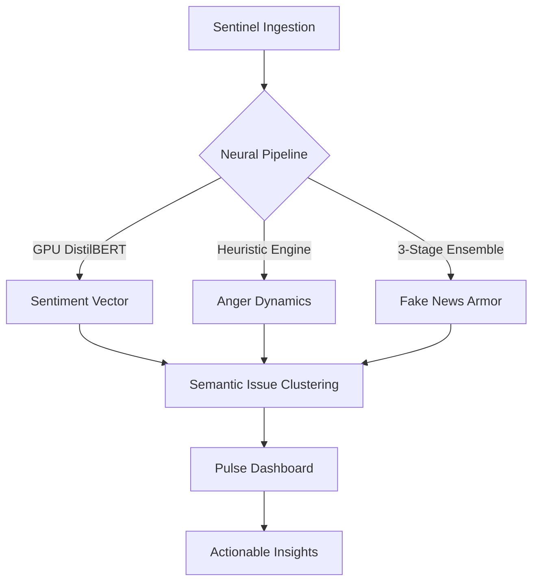

<div align="center">
  <h1>JanNetra</h1>
  <p><b>Advanced Governance Monitoring & Analysis Dashboard</b></p>

  [](https://fastapi.tiangolo.com/)
  [](https://reactjs.org/)
  [](https://www.mongodb.com/)
  [](https://huggingface.co/transformers/)
</div>

> **JanNetra** is an **Advanced Governance Monitoring Platform**. It uses a powerful AI pipeline to turn data from many sources into useful information, providing a real-time way to track and improve social stability.

---

## 🏗️ How it Works

JanNetra is built with three main layers.

### 1. **Data Collection Layer (Input)**
This layer is responsible for constantly gathering data from many different sources:
- **Global News:** Gathers news from over 150 verified sources and the **GDELT Project**, which tracks global events.
- **Social Media:** Uses fast tools to scan **Reddit** and other platforms for community complaints.
- **Official Gov Data:** Monitors **PIB India** and other official announcements to compare them with community reports.
- **Verified Feeds:** Checks trusted Indian news outlets (The Hindu, NDTV, India Express) to verify information.

### 2. **AI Processing Layer (Analysis)**
Raw data is analyzed using a powerful AI pipeline:
- **Mood Tracking:** Uses AI to understand the general mood of the public (Positive vs. Negative).
- **Anger Tracking:** Calculates an **Anger Rating (0-10)** based on how strong the language is.
- **Entity & Department Check:** Automatically identifies the cities and government departments involved in each report.
- **Fake News Guard:** A 3-step check that looks for manipulation, evidence, and source reliability.

### 3. **Decision Layer (Grouping & Alerts)**
Where data is turned into useful info:
- **Automatic Grouping:** Uses AI to group similar reports into shared **Issue Clusters**.
- **Priority Alerts:** Each group is given a **Priority Score (0-100)** based on how often it’s mentioned and how angry people are.
- **Risk Scoring:** The **Governance Risk Score** provides a broad look at risk based on the source, timing, and how fast the news is spreading.

---

## 🚀 Automatic Detection & Dashboard

### **Automatic Detection**
JanNetra removes the need for manual checks by automating the entire process:
- **The 30-Minute Cycle:** Every 30 minutes, the system runs a full "Collect -> Analyze -> Group" cycle.
- **High-Priority Flagging:** Issues with a **Priority Score over 80%** are automatically marked as **CRITICAL** and shown first.
- **Deduplication:** A secure check ensures the dashboard doesn't show the same report twice.

### **Dashboard Features**
The **Management Dashboard** gives you a clear view of the current situation:
- **Main Stats:** Real-time tracking for total issues found, AI accuracy, and system speed.
- **Risk Heatmap:** A visual map showing risks by department (Infrastructure, Police, Health) and local severity.
- **Public Mood Pulse:** A simple chart showing how public mood and anger change over time.
- **Signal Monitor:** A live feed of active groups, letting leaders see the "raw evidence" behind every AI-found problem.

---

## 🧠 Technical Details: Risk Scoring

JanNetra uses advanced AI models to measure complex social issues.

### 🛡️ **Fake News Index**
To fight misinformation, JanNetra checks every report across six areas:
- **Clickbait Score:** Checks for sensationalized headlines.
- **Source Uncertainty:** Tracks unverified claims (e.g., "sources say").
- **Emotional Strength:** Detects aggressive writing and extreme words.
- **Capitalization:** Checks for "shouting" style writing.
- **Missing Attribution:** Penalizes reports that don't name a trusted source.
- **Vague Language:** Calculates how clear or hidden the information is.

### 📊 **Governance Risk Score**
The **Risk Score** is calculated across 5 areas:
- **Source Trust (30%):** How reliable and verified the source is.
- **Content Fake Check (25%):** The "Fake News Index" score.
- **Fact Checking (20%):** Comparing claims against verified data.
- **Timing Check (15%):** Finding unusual posting at odd times.
- **Spreading Risk (10%):** How likely the content is to go viral.

---

## 🗄️ Core Data Models & Schemas

JanNetra utilizes a robust schema-validated MongoDB backend for signal persistence.

| Entity | Description | Core Attributes |
| :--- | :--- | :--- |
| **SignalProblem** | Aggregated issue cluster | `frequency`, `priority_score`, `locations`, `status` |
| **NewsArticle** | Raw harvested intelligence | `content_hash`, `source_url`, `sentiment_polarity`, `gri_score` |
| **Alert** | Escalated notification | `severity`, `department`, `recommendation`, `is_active` |
| **SystemMetric** | Subsystem health state | `subsystem_name`, `current_value`, `status`, `ai_diagnosis` |
| **User** | Governance stakeholder | `role`, `department`, `firebase_uid`, `auth_provider` |

---

## 🖼️ Full Feature Catalog

### **1. Management Suite**
- **Mood Dashboard:** The main screen for a high-level view.
- **Risk Map:** A visual map of governance problems by city and district.
- **Analytics Center:** Deep-dive into public mood and risk heatmaps over time.

### **2. Signal & Problem Management**
- **Signal Monitor:** Real-time auditing of AI-detected issue clusters.
- **Problem Detail:** AI-generated summaries, evidence summaries, and automated resolution paths.
- **Resolutions Portal:** Tracking and verifying fixed problems with "Proof of Work" audits.

### **3. Monitoring & Security**
- **System Monitoring:** Transparent tracking of the ingestion engine, memory, and model health.
- **Scanner:** Ad-hoc NLP tool for one-time verification of external text or URLs.
- **Smart Chatbot:** AI-driven governance assistant for rule-based query handling.

---

## 🛠️ System Blueprint



---

## 🖥️ Live Pulse Console
*Simulated real-time signal processing logs:*

```console
[SENTINEL] :: INGESTING :: REDDIT/MUMBAI-COMMUNITY -> 15 SIGNALS
[NEURAL]   :: ANALYSIS  :: CLUSTER-8A2F -> { ANGER: 8.4, SENTIMENT: NEGATIVE }
[SYTHESIS] :: PRIORITY  :: ISSUE-44C -> RATING: 92.5 [CRITICAL]
[COMMAND]  :: ALERT     :: INFRASTRUCTURE BREACH DETECTED IN DISTRICT-INDORE
```

---

---

## ⚡ Technical Specification & Security

### **1. Security Architecture**
- **Authentication:** Multi-mode auth (Google, Phone OTP, Email) powered by **Firebase Auth**.
- **Authorization:** Role-Based Access Control (RBAC) categorizing users into `LEADER`, `ADMIN`, and `ANALYST` roles.
- **CORS Policy:** Strict origin validation for production and development environments.
- **Data Integrity:** SHA-256 content hashing for deduplication and tamper-evidence in the intelligence pipeline.

### **2. Performance Optimization**
- **GPU Acceleration:** Leveraging **PyTorch + CUDA** for real-time sentiment extraction via DistilBERT.
- **Asynchronous IO:** Backend built on **FastAPI** with `Motor` (Async MongoDB driver) to handle high-concurrency ingestion.
- **Background Scheduler:** **APScheduler** manages the 30-minute intelligence cycle without blocking the main event loop.

### **3. Environment Configuration (.env)**
Ensure the following variables are configured in the `backend/.env` file:
```bash
MONGO_URL=mongodb://localhost:27017
MONGO_DB_NAME=governance_db
NEWSAPI_KEY=your_key_here
FIREBASE_CONFIG_JSON_PATH=./firebase_config.json
```

---

## 🚀 Deployment & Start Guide

### **Phase 1: The Nerve Center (Backend)**
```powershell
cd backend
# Initialize Environment
py -3.11 -m venv venv
venv\Scripts\Activate.ps1
pip install -r requirements.txt

# Launch High-Performance Server
venv\Scripts\python.exe -m uvicorn app.main:app --reload --port 8000
```

### **Phase 2: The Command Surface (Frontend)**
```powershell
cd frontend
npm install
npm run dev
```

---

## 🚥 Connection Matrix

| Interface | Access Point | Signature |
| :--- | :--- | :--- |
| **System API** | `http://localhost:8000` | `200 OK` |
| **Neural Docs** | `http://localhost:8000/docs` | `SWAGGER-V3` |
| **Command Portal** | `http://localhost:5173` | `TRANSMITTING` |

---
*JanNetra: Precision Governance through Neural Intelligence.*

