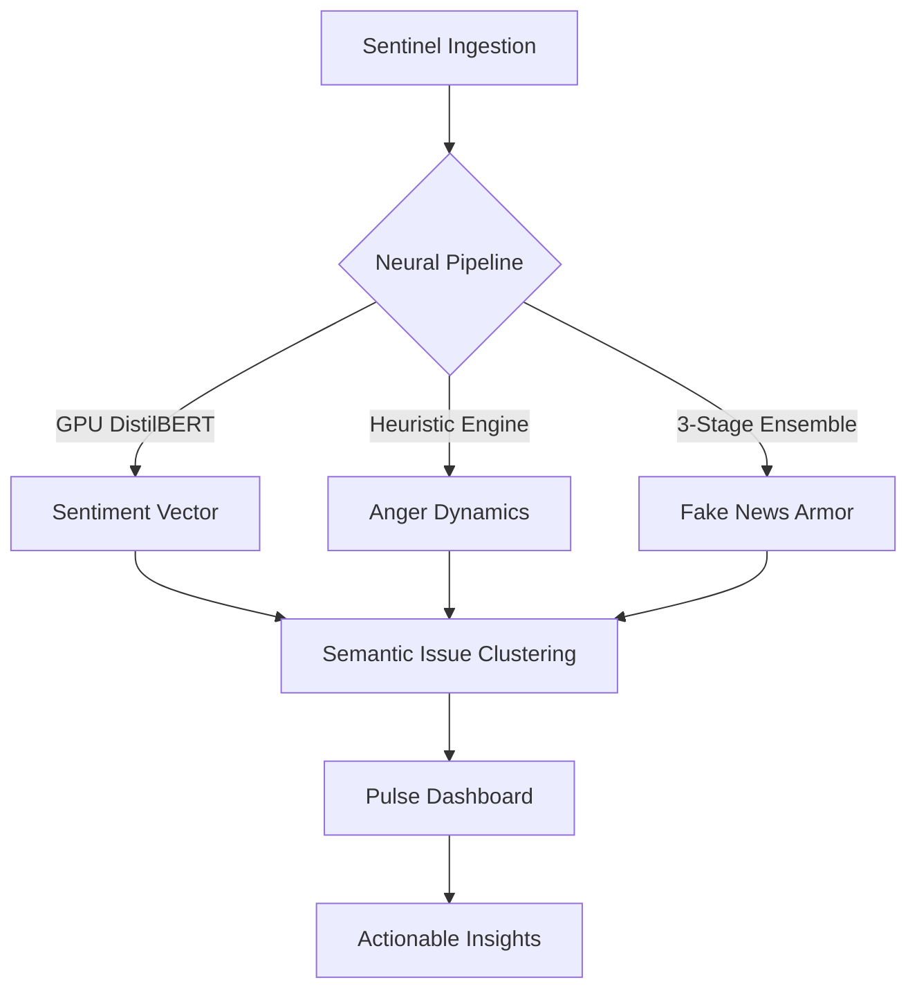

<div align="center">
  <h1>JanNetra</h1>
  <p><b>State-of-the-Art Neural Governance & Intelligence Interface</b></p>

  [](https://fastapi.tiangolo.com/)
  [](https://reactjs.org/)
  [](https://www.mongodb.com/)
  [](https://huggingface.co/transformers/)
</div>

> [!IMPORTANT]
> **JanNetra** is a state-of-the-art **Predictive Governance Intelligence Platform**. It leverages a high-fidelity neural pipeline to transform multi-source noise into actionable governance insights, providing a real-time "Command Surface" for societal stability.

---

## 🌐 The JanNetra Protocol
The platform operates on a four-phase **Intelligence Lifecycle**, ensuring that data isn't just collected, but distilled and synthesized into a "State Pulse."

1.  **Ingestion (Sentinel):** Wide-spectrum scraping across Social Media (Reddit, X), News RSS (Tier-1 Indian Outlets), and Government portals.
2.  **Distillation (Neural):** GPU-accelerated NLP processing to extract sentiment vectors and anger intensity.
3.  **Synthesis (Logic):** Multi-factor risk computation and semantic clustering of hyper-local issues.
4.  **Action (Command):** Visualizing the **State Pulse** for prioritized decision metrics.

---

## 🧠 Neural Architecture & Metrics

JanNetra utilizes an advanced ensemble of models and algorithms to quantify the "unquantifiable."

### 🛡️ **Linguistic Manipulation Index (LMI)**
To combat modern disinformation, JanNetra calculates the **LMI** across every ingested signal:
- **Vector 1 (Clickbait/Hedge):** Heuristic analysis of obfuscation patterns.
- **Vector 2 (Linguistic Weight):** passive voice density and emotional amplification detection.
- **Vector 3 (Source Tier):** Weighted reliability based on historical credibility.

### 📊 **Governance Risk Index (GRI)**
The **GRI** is our proprietary metric for issue prioritization:
$$GRI = (\text{Frequency} \times W_f) + (\text{Anger Intensity} \times W_a) + (\text{Source Credibility} \times W_s)$$
*Where $W$ represents dynamic weights tuned for regional volatility.*

---

## 🛠️ System Blueprint



---

## 🖥️ Live Pulse Console
*Simulated real-time signal processing logs:*

```console
[SENTINEL] :: INGESTING :: REDDIT/MUMBAI-COMMUNITY -> 15 SIGNALS
[NEURAL]   :: ANALYSIS  :: CLUSTER-8A2F -> { ANGER: 8.4, SENTIMENT: NEGATIVE }
[SYTHESIS] :: PRIORITY  :: ISSUE-44C -> RATING: 92.5 [CRITICAL]
[COMMAND]  :: ALERT     :: INFRASTRUCTURE BREACH DETECTED IN DISTRICT-INDORE
```

---

## ⚡ Technical Specification

### **Core Systems**
- **Neural Hub:** `FastAPI` (Python 3.11+) optimized for asynchronous IO.
- **Intelligence Model:** `Hugging Face Transformers` (DistilBERT SST-2).
- **Data Persistence:** `SQLite` (Relational Entities) & `MongoDB` (Unstructured Signals).
- **Front-End Interface:** `React 18` + `Vite` for ultra-fast UX response.

### **Zero-Dependency Quick Start**
1. **Initialize Engine:** `cd backend && pip install -r requirements.txt`
2. **Launch Neural Layer:** `python -m uvicorn app.main:app --reload --port 8000`
3. **Connect Command Layer:** `cd frontend && npm install && npm run dev`

---

## 🔗 Connection Matrix

| Interface | Access Point | Signature |
| :--- | :--- | :--- |
| **System API** | `http://localhost:8000` | `200 OK` |
| **Neural Docs** | `http://localhost:8000/docs` | `SWAGGER-V3` |
| **Command Portal** | `http://localhost:5173` | `TRANSMITTING` |

---
*JanNetra: Precision Governance through Neural Intelligence.*

