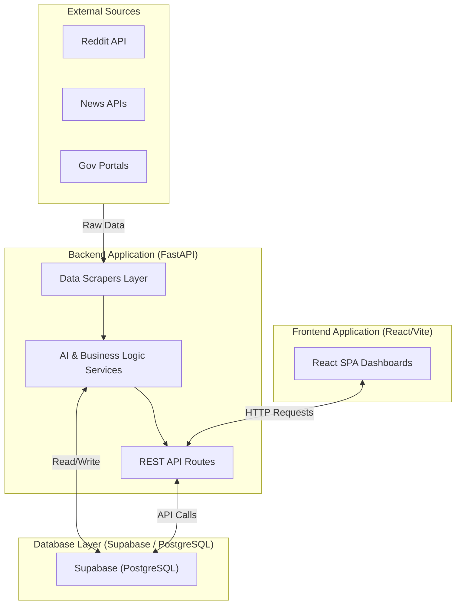
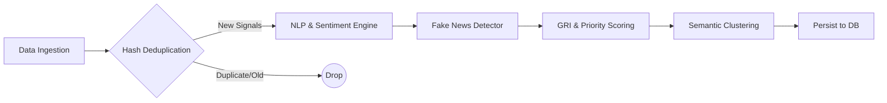
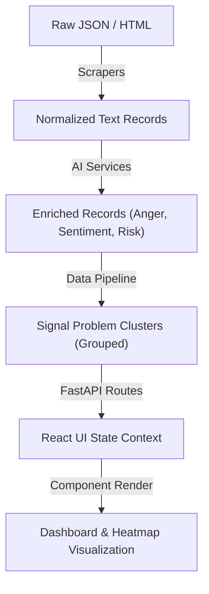

# JanNetra Project Architecture

This document provides a detailed overview of the structural and systemic architecture of **JanNetra**, an Advanced Governance Monitoring & Analysis Dashboard.

## 1. High-Level Overview

JanNetra operates on a decoupled client-server architecture:
- **Backend (`/backend`)**: A highly concurrent Python/FastAPI service responsible for data ingestion, AI-driven natural language processing (NLP), fake news detection, and API provisioning. It uses Supabase (PostgreSQL) for data persistence.
- **Frontend (`/frontend`)**: A React Single Page Application (SPA) built with Vite, offering real-time dashboards, risk heatmaps, and signal monitoring interfaces.

---

## 2. System Architecture & Wireframes

To provide a clear view of the architecture, the system is broken down into three visualizations: Overall Wireframe, Data Pipeline, and Data Flow.

### 2.1. Overall System Wireframe

This diagram illustrates the high-level components and their relationships:



### 2.2. Data Processing Pipeline

This diagram focuses on the 30-minute automated ingestion and intelligence cycle handled by `data_pipeline.py`.



### 2.3. End-to-End Data Flow

This diagram illustrates how data transforms from external sources into actionable UI states.



---

## 3. Full Project Directory Structure

```text
jannetra/
├── backend/                  # Core Python FastAPI Application
│   ├── app/
│   │   ├── routes/           # API Endpoints (Controllers)
│   │   ├── scrapers/         # Data Ingestion Modules
│   │   ├── services/         # Core Business & AI Logic
│   │   ├── main.py           # FastAPI Application Entrypoint
│   │   ├── models.py         # Pydantic & Database Schemas
│   │   ├── database.py       # Core Database Access Layer
│   │   ├── db_helpers.py     # Database Helper Functions
│   │   ├── supabase_client.py# Supabase Connection Management
│   │   ├── firebase_admin_config.py # Auth Configuration
│   │   └── utils.py          # Shared Helper Functions
│   ├── scripts/              # Utility scripts (e.g., db checks, api tests)
│   ├── requirements.txt      # Python Dependencies
│   └── run_backend.ps1       # Startup Script
│
├── frontend/                 # React UI Application (Vite)
│   ├── src/
│   │   ├── assets/           # Static Assets (Images, Icons)
│   │   ├── components/       # Reusable UI Components
│   │   ├── config/           # App Configurations
│   │   ├── context/          # React Contexts (State Management)
│   │   ├── pages/            # Application Views (Routable)
│   │   ├── services/         # API Clients & Auth Logic
│   │   ├── utils/            # Frontend Helper Functions
│   │   ├── App.jsx           # Main App Component & Router
│   │   └── main.jsx          # React DOM Entrypoint
│   ├── package.json          # Node Dependencies & Scripts
│   └── vite.config.js        # Vite Build Configuration
│
└── README.md                 # Primary Project Documentation
```

---

## 4. Backend Architecture Detail (Expanded)

The backend follows a robust layered architecture pattern focused on high-throughput data processing and API provisioning.

### A. Scrapers (Data Ingestion Layer)
Located in `backend/app/scrapers/`, this layer harvests unstructured data autonomously triggered by `APScheduler`:
- **`gov_portal_scraper.py`**: Monitors official government portals (e.g., PIB) for verified statements.
- **`news_scraper.py`**: Gathers articles from verified news outlets focusing on specific problem queries (e.g., "pothole", "water logging").
- **`reddit_scraper.py`**: Ingests community sentiment and localized complaints from specific subreddits (e.g., r/mumbai).
- **`rss_scraper.py`**: Reads syndication feeds from various sources.

### B. Services (Business & AI Layer)
Located in `backend/app/services/`, this is the analytical core of JanNetra:
- **`data_pipeline.py`**: The master orchestrator. It runs the full cycle: `Scrape -> Filter -> Process -> Cluster -> Store`. It incorporates deduplication via content hashes.
- **`nlp_service.py` & `ai_service.py`**: Executes advanced NLP pipelines. It utilizes `DistilBERT/Transformers` to extract:
  - Subjectivity & Sentiment Polarity.
  - Anger Rating (measuring the emotional charge of the text).
  - Categorization into governance sectors (e.g., "Civil Infrastructure", "Crime").
- **`fake_news_detector.py`**: Validates credibility. It analyzes clickbait tendencies, linguistic manipulation, and source tiers to output a Fake News label and confidence score.
- **`gri_service.py`**: Computes the **Governance Risk Index (GRI)**. A composite metric factoring in source credibility, fake news score, and publication timing.
- **`location_service.py`**: Extracts and normalizes City, District, and State from raw unstructured text.

### C. Routes (API Layer)
Located in `backend/app/routes/`, exposing RESTful endpoints via FastAPI:
- **Dashboards & Analytics**: `dashboard.py`, `analytics.py`, `leaderboard.py`
- **Data Entities**: `articles.py`, `citizen_reports.py`, `complaints.py`
- **System & Monitoring**: `system_monitoring.py`, `scanner.py`, `chatbot.py`
- **Core Governance**: `signal_problems.py`, `alerts.py`, `resolutions.py`

### D. Core Data Models
Pydantic schemas in `models.py` validate the data before MongoDB ingestion. Key entities include:
- `SignalProblem`: Aggregated clusters of issues grouped by category, city, and semantic similarity.
- `NewsArticle`: Raw harvested intelligence data.
- `Alert`: Escalated notifications for high-priority clusters.

---

## 5. Frontend Architecture Detail

The frontend is a component-driven React application designed for high-density data visualization and rapid decision-making.

### A. Pages (Views)
Located in `frontend/src/pages/`, mapping to application routes:
- **Command & Dashboards**: `Dashboard.jsx`, `PulseDashboard.jsx`, `Analytics.jsx`
- **Data Monitoring**: `SignalMonitor.jsx`, `MapView.jsx`, `SystemMonitoring.jsx`
- **Issues & Actions**: `ProblemDetail.jsx`, `WorkingProblems.jsx`, `Resolutions.jsx`
- **Auth & Access**: `Login.jsx`, `Signup.jsx`, `PhoneAuth.jsx`, `LandingPage.jsx`

### B. Components (UI Modules)
Located in `frontend/src/components/`, ensuring reusability:
- `Navbar.jsx` / `Sidebar.jsx`: Global navigation and layout structuring.
- `RiskHeatmapMap.jsx`: Geospatial visualization (likely utilizing Leaflet or Mapbox) of localized governance risks.
- `ExportReportModal.jsx` / `LocationFilter.jsx`: Utility interaction components.
- Subdirectories (`ui/`, `Landing/`, `Ballpit/`) housing specific thematic elements for a premium user experience.

### C. Services (Client-Side API)
Located in `frontend/src/services/`:
- `apiClient.js` / `api.js`: Pre-configured Axios instances with request/response interceptors to handle JWT token injection and centralized error handling.
- `authService.js`: Encapsulates Firebase Authentication logic (Google, Phone OTP, Email).

---

## 6. Execution Pipeline Details

The data pipeline runs automatically every 30 minutes, ensuring real-time relevance:

1. **Ingestion Trigger**: `APScheduler` fires the scraper sequence.
2. **Harvest**: Scrapers pull raw JSON/HTML data.
3. **Hash Filtering**: The pipeline checks the Supabase `news_articles` table for existing `content_hash`es. Duplicates and signals older than 5 days are dropped to conserve NLP processing costs.
4. **NLP & Detection**: Fresh signals undergo Sentiment Analysis, Anger Rating extraction, and Fake News detection.
5. **Semantic Clustering**: The system attempts to match the new signal with existing `SignalProblem` clusters based on:
   - Same Category & City.
   - Semantic Title Similarity (> 65%).
   If matched, the cluster's frequency and severity are updated. If not, a new cluster is created.
6. **Priority Scoring**:
   - `Priority Score = (Frequency * 3.0) + Source Weight + Sentiment Weight + Recency Weight`
   - Clusters scoring over 80 are flagged as `CRITICAL`.
7. **Persistence**: Clusters are upserted into the `signal_problems` collection; raw data is inserted into `news_articles`.

---

## 7. Technology Stack Summary

- **Core Backend**: Python 3.11+, FastAPI, Uvicorn
- **AI / ML**: PyTorch, HuggingFace Transformers (DistilBERT), custom heuristics.
- **Database**: Supabase (PostgreSQL)
- **Authentication**: Firebase Auth (integrated on both React client and FastAPI via middleware).
- **Core Frontend**: React.js, Vite, TailwindCSS (for rapid UI styling).
- **Task Scheduling**: APScheduler (for background intelligence cycles).
